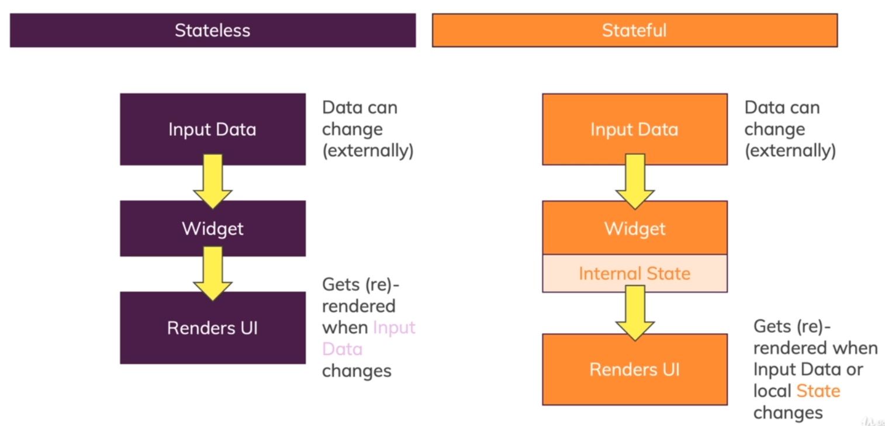
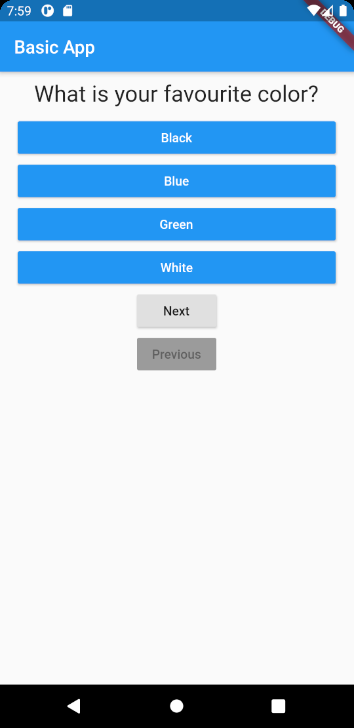

# counter_app

### MaterialApp (provided by material library)
- This widget sets up a basic layout in android to show some output.
- The background is black in color and text styling by default doesn't look neat.
- `home` is a required argument for `MaterialApp`.
- `Text` widget can be passed to `home` to show some basic text.

### Scaffold    (provided by material library)
- This creates a basic white background for the app.
- `appbar` will create a appbar at the top.
- Pass widget to `body` to show the content to the main screen.

### Column
- To pass multiple widgets use `column` which takes a list of widgets.

### RaisedButton
- To create a button.
- `onPressed` is a required argument(will get a warning if not used).
- A function can be passed to `onPressed` to do some action.

### State in Flutter
- We have created a list of questions and button increases a count so that we can show the questions in the list.
- But the count increases but doesn't gets updated in the screen.
- It is because the widget is stateless.
- To overcome this problem(recreate UI when state changes) we need to change the widget to a stateful widget.

### Stateful Widget
- Two classes create a stateful widget:
    - `State` class (along with pointer to the Widget class) to persist data
    - `StatefulWidget` class to recreate widget on state change
- `State` class is created as private class to prevent using it from other files.
- Connection is created between State class and Widget class.
- Value is updated in `setState` class method given by `State` class.
- `setState` takes a anonymous function.
- `setState` forces flutter to re-render the widget (only in which the state has changed).
- Now if the data or state changes the widget gets recreated.

### Text Widget
- In `style` argument we can pass `TextStyle` widget to add styling like size, font, etc.
- `textAlign` argument takes an enum `TextAlign`. But since the Text widget takes the size only needed for text,
it wont work unless we put it in a container and add some width to the text.

### Dart features
- enums
- multiple constructors
- Map or {} (like dictionary in python)

